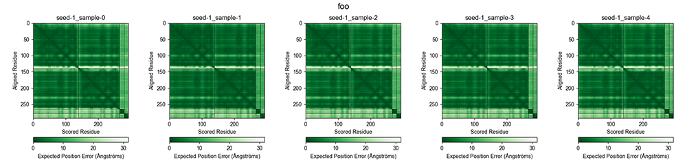
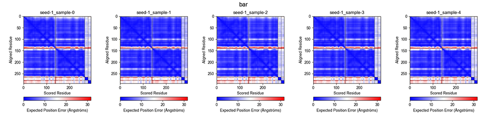
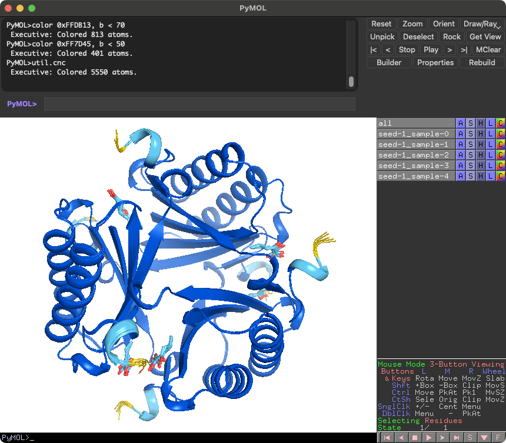

# alphafold3_tools

Toolkit for alphafold3 input generation and output analysis.

## Installation

Requirements:

- Python 3.10 or later

`brew install python@3.12` with [Homebrew](https://brew.sh/) is useful to install python3.12 on macOS.

> [!NOTE]
> If you are using python3.12, create and activate venv at first.
> `/path/to/workingdirectory` is your working directory.
>
> ```bash
> mkdir -p /path/to/workingdirectory ; cd /path/to/workingdirectory
> python3.12 -m venv .venv
> source .venv/bin/activate
> ```

```bash
# Ubuntu 22.04 uses python3.10 by default. Use python3.12 if you have it instead of python3.10.
# install from GitHub
python3 -m pip install git+https://github.com/cddlab/alphafold3_tools.git
# upgrade
python3 -m pip uninstall alphafold3_tools -y && python3 -m pip install --upgrade git+https://github.com/cddlab/alphafold3_tools.git
```

On Ubuntu, the commands will be installed in `~/.local/bin` or in the `.venv` directory (e.g. `/path/to/workingdirectory/.venv/bin`). You may need to add this directory to your `PATH` environment variable.

```bash
export PATH=$PATH:~/.local/bin
```

## Usage

More detailed usage information can be found by running the commands with the `-h` option.

### msatojson

`msatojson` is a command to convert an a3m-formatted multiple sequence alignment (MSA) file to JSON format. The input name can be specified with the `-n` option.

```bash
msatojson -i input.a3m -o input.json -n inputname
```

The input a3m MSA file can be generated by MMSeqs2 webserver (or ColabFold). `colabfold_batch --msa-only` option is useful to generate a3m MSA files only.

`msatojson` can accept a directory containing multiple a3m files. In this case, the output JSON files will be saved in the specified output directory.

```bash
msatojson -i /path/to/a3m_containing/directory -o /path/to/output/directory
```

> [!WARNING]
> Currently including templates is not supported. I am working on it.

### fastatojson

`fastatojson` is a command to convert a FASTA file to JSON format compatible with AlphaFold3.

```bash
fastatojson -i input.fasta [-s 1 2 3 ...] [-d]
```

- `-i`: Input FASTA file. Mandatory.
- `-s`: Model seeds to be used. Optional. Default is `1`. Multiple seeds can be specified.
- `-d`: Debug mode. Optional. If specified, the command will print debug information.

For example, if you have a FASTA file containing two sequences, `input.fasta`:

```shell
>P12345
KAKDLSKCLS
>Q67890
KADFILCSLK
>I23L45_I3PLS2
LAKDCL:KKALS
```

You will obtain three JSON files, `p12345.json`, `q67890.json`, and `i23l45_i3pls2.json`. The last one contains two sequences, `LAKDCL` and `KKALS`, which are separated by a colon (`:`). The output JSON files will look like this:

```json
{
  "name": "i23l45_i3pls2",
  "dialect": "alphafold3",
  "version": 1,
  "sequences": [
    {
      "protein": {
        "id": ["A"],
        "sequence": "LAKDCL"
      },
      "protein": {
        "id": ["B"],
        "sequence": "KKALS"
      }
    }
  ],
  "modelSeeds": [1],
}
```

### paeplot

`paeplot` is a command to plot the predicted aligned error (PAE). The color map can be specified with the `-c` option. The default color map is `bwr` (ColabFold-like), but `Greens_r` is also available for AlphaFold Structure Database (AFDB)-like coloring.

```bash
paeplot -i /path/to/alphafold3_output/directory -c Greens_r --dpi 300 [-n foo] [-a]
```




### superpose_ciffiles

`superpose_ciffiles` is a command to superpose the output mmCIF files. The command creates a multi-model mmCIF file containing all the predicted `model.cif` subdirectories. The output file name can be specified with the `-o` option. By default, the output file will be saved as `foo_superposed.cif` in the input directory.
`-c` option can be used to specify the chain ID to be superposed.

```bash
superpose_ciffiles -i /path/to/alphafold3_output/directory [-o /path/to/output/directory/foo_superposed.cif] [-c A]
```


In [PyMOL](https://www.pymol.org/), the following command will be useful to visualize the plDDT values.

```bash
color 0x0053D6, b < 100
color 0x65CBF3, b < 90
color 0xFFDB13, b < 70
color 0xFF7D45, b < 50
util.cnc
```



> [!NOTE]
> To visualize only an object of `seed-1_sample-0` with plddt values, type the following command in PyMOL.
>
> ```bash
> color 0x0053D6, seed-1_sample-0 and b < 100
> color 0x65CBF3, seed-1_sample-0 and b < 90
> color 0xFFDB13, seed-1_sample-0 and b < 70
> color 0xFF7D45, seed-1_sample-0 and b < 50
> ```

### sdftoccd

`sdftoccd` is a command to convert sdf file to ccd format. Please refer to the [AlphaFold3's input document](https://github.com/google-deepmind/alphafold3/blob/main/docs/input.md#user-provided-ccd-format) for the detail of User-provided CCD format.

```bash
sdftoccd -i input.sdf -o userccd.cif -n STR
```

### modjson

`modjson` is a command to modify an existing AlphaFold3 input json file. This tool is useful to add/modify the ligand entities and User-provided CCD string in an input json file.

```bash
modjson -i input.json -o output.json [-n jobname] [-p] \
       [-a smiles "CCOCCC" 1 -a ccdCodes PRD 2] \
       [-u userccd1.cif userccd2.cif]
```

- `-i`: Input json file. Mandatory.
- `-o`: Output json file. Mandatory.
- `-n`: Job name. Optional. Sets the job name in the input JSON file.
- `-p`: Purge all ligand entities from the input JSON file at first.
- `-a`: Add ligand to the input JSON file. Provide 'ligand type', 'ligand name', and 'number of the ligand molecule'. The 'ligand type' must be either 'smiles' or 'ccdCodes'. Multiple ligands can be added.
  - Example: `-a smiles "CCOCCC" 1 -a ccdCodes PRD 2 -a ...`
- `-u`: Add user provided ccdCodes to the input JSON file. Multiple files can be provided.
  - Example: `-u userccd1.cif userccd2.cif`

> [!NOTE]
> A `*_data.json` file in the AlphaFold3's output directory can be also used as an input JSON file of `modjson`.

### jsontomsa

`jsontomsa` is a command to extract MSA from the AlphaFold3 input JSON file. The output file name can be specified with the `-o` option.

```bash
jsontomsa -i /path/to/alphafold3_data.json -o /path/to/out.a3m
```

Other tools are being developed and will be added.

## Acknowledgements

This tool uses the following libraries:

- [RDKit](https://www.rdkit.org/)
- [matplotlib](https://matplotlib.org/)
- [numpy](https://numpy.org/)
- [gemmi](https://gemmi.readthedocs.io/en/latest/)
- [loguru](https://loguru.readthedocs.io/en/stable/)

[PDBeurope/ccdutils](https://github.com/PDBeurope/ccdutils) is used for the conversion of sdf to ccd.
