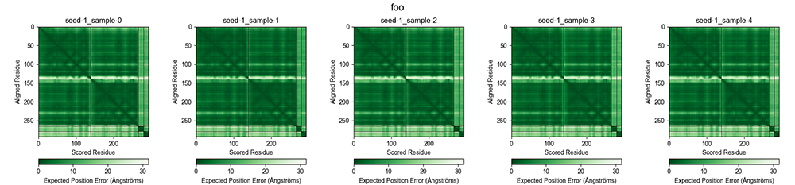
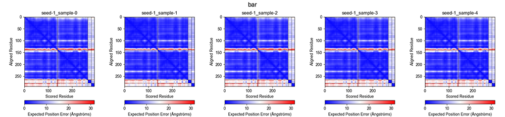
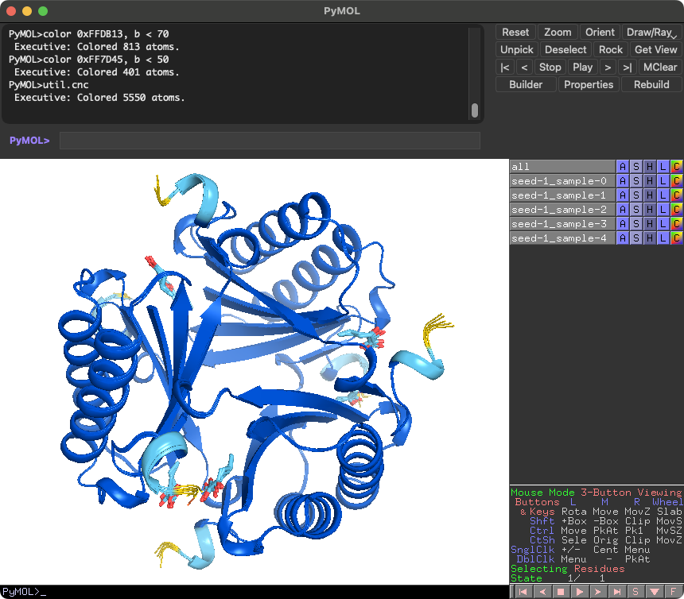

# alphafold3_tools

Toolkit for alphafold3 input generation and output analysis

[](https://www.python.org/downloads/release/python-3100/) [](https://opensource.org/licenses/BSD-2-Clause)

## Installation

Requirements:

- Python 3.12 or later

```bash
# install from GitHub
python3 -m pip install alphafold3-tools
```

## Usage

More detailed usage information can be found by running the commands with the `-h` option. The version information will be displayed with the `-v` option.

### msatojson

`msatojson` is a command to convert an a3m-formatted multiple sequence alignment (MSA) file to JSON format. The input name can be specified with the `-n` option.

```bash
msatojson -i input.a3m -o input.json -n inputname
```

The input a3m MSA file can be generated by MMSeqs2 webserver (or ColabFold). `colabfold_batch --msa-only` option is useful to generate a3m MSA files only.

`msatojson` can accept a directory containing multiple a3m files. In this case, the output JSON files will be saved in the specified output directory.

```bash
msatojson -i /path/to/a3m_containing/directory -o /path/to/output/directory
```

From version 0.2.0, templates can be also added to the output JSON file. Use the `--include_templates` option to include templates. The directory path `/path/to/mmcif_files` containing mmCIF files and the corresponding `pdb_seqres.txt` file must be specified with the `--pdb_database_path` and `--seqres_database_path` options, respectively.

- `--max_template_date` option can be used to set the maximum template date. The default value is `2099-09-30`, which means no filtering based on template date. **If you want to the same results as AlphaFold3, set this value to `2021-09-30`.**
- `--max_subsequence_ratio` option can be used to set the maximum subsequence ratio for template filtering. The default value is `0.95` (same as the default value of AlphaFold3). However, if you want to include all templates regardless of the subsequence ratio, set this option to `1.0`.
- `-d` option can be used to enable debug mode, which will print debug information during the template search process.

```bash
# Example command to include templates in the output JSON file
msatojson -i input.a3m -o output.json \
    --include_templates \
    --pdb_database_path /path/to/mmcif_files \
    --seqres_database_path /path/to/pdb_seqres.txt \
    --max_template_date 2099-09-30 \
    --hmmbuild_binary_path /path/to/hmmbuild \
    --hmmsearch_binary_path /path/to/hmmsearch \
    --save_hmmsto \
    --max_subsequence_ratio 1.0 \
    -d
```

> [!NOTE]
>
> - This feature requires HMMER 3 or later to be installed and accessible in your PATH. For macOS users, you can install HMMER via Homebrew:
>
> ```bash
> brew install hmmer
> ```
>
> - `--hmmbuild_binary_path` and `--hmmsearch_binary_path` options can be used to specify the paths to the `hmmbuild` and `hmmsearch` binaries, respectively, if they are not in your PATH.
> - `--save_hmmsto` option can be used to save HMMER's intermediate file.
> - The `pdb_seqres.txt` file can be downloaded from [wwPDB](https://files.rcsb.org/pub/pdb/derived_data/pdb_seqres.txt). The file size is about 356 MB (as of Dec. 2025).
>

### fastatojson

`fastatojson` is a command to convert a FASTA file to JSON format compatible with AlphaFold3.

```bash
fastatojson -i input.fasta [-s 1 2 3 ...] [-d]
```

- `-i`: Input FASTA file. Mandatory.
- `-s`: Model seeds to be used. Optional. Default is `1`. Multiple seeds can be specified.
- `-d`: Debug mode. Optional. If specified, the command will print debug information.

For example, if you have a FASTA file containing two sequences, `input.fasta`:

```shell
>P12345
KAKDLSKCLS
>Q67890
KADFILCSLK
>I23L45_I3PLS2
LAKDCL:KKALS
```

You will obtain three JSON files, `p12345.json`, `q67890.json`, and `i23l45_i3pls2.json`. The last one contains two sequences, `LAKDCL` and `KKALS`, which are separated by a colon (`:`). The output JSON files will look like this:

```json
{
  "name": "i23l45_i3pls2",
  "dialect": "alphafold3",
  "version": 1,
  "sequences": [
    {
      "protein": {
        "id": ["A"],
        "sequence": "LAKDCL"
      },
      "protein": {
        "id": ["B"],
        "sequence": "KKALS"
      }
    }
  ],
  "modelSeeds": [1],
}
```

### modjson

`modjson` is a command to modify an existing AlphaFold3 input json file. This tool is useful to add/modify the ligand entities and User-provided CCD string in an input json file.

```bash
modjson -i input.json -o output.json [-n jobname] [-p] \
       [-a smiles "CCOCCC" 1 -a ccdCodes PRD 2] \
       [-u userccd1.cif userccd2.cif]
```

- `-i`: Input json file. Mandatory.
- `-o`: Output json file. Mandatory.
- `-n`: Job name. Optional. Sets the job name in the input JSON file.
- `-p`: Purge all ligand entities from the input JSON file at first.
- `-a`: Add ligand to the input JSON file. Provide 'ligand type', 'ligand name', and 'number of the ligand molecule'. The 'ligand type' must be either 'smiles' or 'ccdCodes'. Multiple ligands can be added.
  - Example: `-a smiles "CCOCCC" 1 -a ccdCodes PRD 2 -a ...`
- `-u`: Add user provided ccdCodes to the input JSON file. Multiple files can be provided.
  - Example: `-u userccd1.cif userccd2.cif`

> [!NOTE]
> A `*_data.json` file in the AlphaFold3's output directory can be also used as an input JSON file of `modjson`.

### paeplot

`paeplot` is a command to plot the predicted aligned error (PAE). The color map can be specified with the `-c` option. The default color map is `bwr` (ColabFold-like), but `Greens_r` is also available for AlphaFold Structure Database (AFDB)-like coloring.

```bash
paeplot -i /path/to/alphafold3_output/directory [-c {Greens_r,bwr}] [--dpi 300] [-n foo] [-f {png,svg}] [-a] [-t "PAE Plot"] [--chain-cmap {pymol,unhcr,<matplotlib_colormap_name>}]
```




arguments:

- `-i`: Input directory containing the AlphaFold3 output files. Mandatory.
- `-c`: Color map for the PAE plot. Optional. Default is `bwr`. Choose either `Greens_r` or `bwr`.
- `--dpi`: DPI of the output image. Optional. Default is `100`, but `300` is recommended for publication-quality images.
- `-n`: Name prefix for the output image file. Optional.
- `-f`: Output image file format. Optional. Choose either `png` or `svg`. Default is `png`.
- `-a`: If specified, the plot will include all models in the output directory.
- `-t`: Title of the plot. Optional.
- `--chain-cmap`: Color map for chain coloring on top and right. Optional. Choose either `pymol`, `unhcr`, or any valid matplotlib colormap name. (e.g. `tab20`) Default is `pymol`.

### superpose_ciffiles

`superpose_ciffiles` is a command to superpose the output mmCIF files. The command creates a multi-model mmCIF file containing all the predicted `model.cif` subdirectories. The output file name can be specified with the `-o` option. By default, the output file will be saved as `foo_superposed.cif` in the input directory.
`-c` option can be used to specify the chain ID to be superposed.

```bash
superpose_ciffiles -i /path/to/alphafold3_output/directory [-o /path/to/output/directory/foo_superposed.cif] [-c A]
```

In [PyMOL](https://www.pymol.org/), the following command will be useful to visualize the plDDT values.

```bash
color 0x0053D6, b < 100
color 0x65CBF3, b < 90
color 0xFFDB13, b < 70
color 0xFF7D45, b < 50
util.cnc
```



> [!NOTE]
> To visualize only an object of `seed-1_sample-0` with plddt values, type the following command in PyMOL.
>
> ```bash
> color 0x0053D6, seed-1_sample-0 and b < 100
> color 0x65CBF3, seed-1_sample-0 and b < 90
> color 0xFFDB13, seed-1_sample-0 and b < 70
> color 0xFF7D45, seed-1_sample-0 and b < 50
> ```

### sdftoccd

`sdftoccd` is a command to convert sdf file to ccd format. Please refer to the [AlphaFold3's input document](https://github.com/google-deepmind/alphafold3/blob/main/docs/input.md#user-provided-ccd-format) for the detail of User-provided CCD format.

```bash
sdftoccd -i input.sdf -o userccd.cif -n STR
```

### jsontomsa

`jsontomsa` is a command to extract MSA from the AlphaFold3 input JSON file. The output file name can be specified with the `-o` option.

```bash
jsontomsa -i /path/to/alphafold3_data.json -o /path/to/out.a3m
```

### pdbtocif

`pdbtocif` is a command to convert a PDB file to mmCIF format. The output file name can be specified with the `-o` option.

```bash
pdbtocif -i input.pdb -o output.cif [--pdb_id XXXX]
```

This tool is useful for converting legacy PDB-formatted files into mmCIF format, which is required for template search in msatojson as well as for input to AlphaFold 3.
The `--pdb_id` option allows users to specify the PDB ID assigned to the output mmCIF file. This is particularly useful when using predicted structures (e.g., from the AlphaFold Structure Database) as templates, because such structures often have nonstandard identifiers (e.g., AF-P12345-F1-model_v1) that are not suitable for template search. By default, the PDB ID in the output mmCIF file is set to `xxxx`. The PDB ID must be a four-character string consisting of lowercase letters and/or digits, as the template search in `msatojson` is case-sensitive and the template database uses lowercase PDB IDs.

Other tools are being developed and will be added.

## ipsae

`ipsae` calculates [ipSAE](https://www.biorxiv.org/content/10.1101/2025.02.10.637595v2) and related interaction scores (ipTM, [pDockQ](https://www.nature.com/articles/s41467-022-28865-w), [pDockQ2](https://academic.oup.com/bioinformatics/article/39/7/btad424/7219714), [LIS](https://www.biorxiv.org/content/10.1101/2024.02.19.580970v1)) for protein–protein (and protein–nucleic acid) complexes predicted by AlphaFold3, ColabFold, or Boltz. It is a reimplementation of [ipsae.py](https://github.com/DunbrackLab/IPSAE) (MIT License) by Roland L. Dunbrack Jr., extended with JSON output and batch processing support.

### Basic usage — explicit file paths

Specify PAE and structure files directly, equivalent to the original `ipsae.py` interface:

```bash
ipsae -p model_scores_rank_001.json -s model_relaxed_rank_001.pdb [-pc 10 -dc 10]
```

Options:

- `-p / --pae_file`: PAE file (`.json` for AF2/AF3, `.npz` for Boltz)
- `-s / --struct_file`: Structure file (`.pdb` for AF2/Boltz, `.cif` for AF3/Boltz)
- `-pc / --pae_cutoff`: PAE threshold in Å (default: `10.0`)
- `-dc / --dist_cutoff`: Cβ distance threshold in Å (default: `10.0`)

### Directory mode — automatic input detection

```bash
ipsae -i /path/to/output_directory
```

When a directory is passed with `-i`, `ipsae` auto-detects the prediction format:

| Format | PAE file | Structure file |
| -------- | ---------- | ---------------- |
| AlphaFold3 | `*_confidences.json` | `*_model.cif` |
| ColabFold | `*_scores_rank_001_alphafold2_multimer_v3_model_*_seed_*.json` | `*_relaxed_rank_001_*.pdb` (falls back to `*_unrelaxed_*` if absent) |

#### Batch processing for ColabFold outputs

When the directory contains multiple ColabFold predictions, `ipsae` automatically processes all of them in one run. A prediction with prefix `foobar` is considered complete when both `foobar.done.txt` and `foobar_coverage.png` exist in the same directory. Prefix validation runs in parallel across all available CPU cores.

```bash
# Process all completed predictions in a ColabFold output directory
ipsae -i /path/to/colabfold_output_dir
```

### Output files

Three files are written next to each structure file:

| File | Description |
| ------ | ------------- |
| `{stem}_{pae}_{dist}.txt` | Summary score table |
| `{stem}_{pae}_{dist}_byres.txt` | Per-residue score table |
| `{stem}_{pae}_{dist}.pml` | PyMOL script for interface visualisation |

### JSON output with ipSAE\_min / ipSAE\_max

```bash
ipsae -i /path/to/output_directory --json
```

The `--json` flag replaces the `.txt` summary with a `.json` file. The JSON format extends the original ipSAE output by providing, for each chain pair, the **asymmetric** score for each direction as well as `max` and `min` values across the two asymmetric directions (`ipSAE_max` and `ipSAE_min`):

```json
{
  "model_name": {
    "pae_cutoff": 10,
    "dist_cutoff": 10,
    "A-B": {
      "asym": [
        {"chain1": "A", "chain2": "B", "ipSAE": 0.382, "ipSAE_d0chn": 0.412, "ipSAE_d0dom": 0.401, "ipTM_af": 0.65, "pDockQ": 0.731, "pDockQ2": 0.612, "LIS": 0.524, "...": "..."},
        {"chain1": "B", "chain2": "A", "ipSAE": 0.315, "ipSAE_d0chn": 0.298, "ipSAE_d0dom": 0.307, "ipTM_af": 0.65, "pDockQ": 0.731, "pDockQ2": 0.589, "LIS": 0.511, "...": "..."}
      ],
      "max": {"chain1": "A", "chain2": "B", "ipSAE": 0.382, "...": "..."},
      "min": {"chain1": "A", "chain2": "B", "ipSAE": 0.315, "...": "..."}
    }
  }
}
```

### All usage examples

```bash
# AF2/ColabFold — explicit file paths (original ipsae.py interface)
ipsae -p foo_scores_rank_001_alphafold2_multimer_v3_model_1_seed_000.json \
      -s foo_relaxed_rank_001_alphafold2_multimer_v3_model_1_seed_000.pdb

# AlphaFold3 — directory auto-detection
ipsae -i /path/to/af3_seed-1_sample-0

# ColabFold — batch processing of an entire output directory
ipsae -i /path/to/colabfold_output_dir

# Custom cutoffs
ipsae -i /path/to/af3_seed-1_sample-0 -pc 15 -dc 15

# JSON output (includes ipSAE_min and ipSAE_max per chain pair)
ipsae -i /path/to/af3_seed-1_sample-0 --json

# ColabFold batch with JSON output
ipsae -i /path/to/colabfold_output_dir --json
```

## Acknowledgements

This tool uses the following libraries:

- [RDKit](https://www.rdkit.org/)
- [matplotlib](https://matplotlib.org/)
- [numpy](https://numpy.org/)
- [gemmi](https://gemmi.readthedocs.io/en/latest/)
- [loguru](https://loguru.readthedocs.io/en/stable/)
- [IPSAE](https://github.com/DunbrackLab/IPSAE)

[PDBeurope/ccdutils](https://github.com/PDBeurope/ccdutils) is used for the conversion of sdf to ccd.
RCSB PDB's [MAXIT](https://sw-tools.rcsb.org/apps/MAXIT/source.html) v11.400 is used as a reference for the conversion of PDB to mmCIF.

## How do I reference this work?

- Moriwaki Y et al. [High-throughput prediction of protein–protein interactions uncovers hidden molecular networks in biosynthetic gene clusters](https://www.biorxiv.org/content/10.1101/2025.10.26.684697v2), bioRxiv 2025.10.26.684697; doi: [10.1101/2025.10.26.684697](https://doi.org/10.1101/2025.10.26.684697v2)
